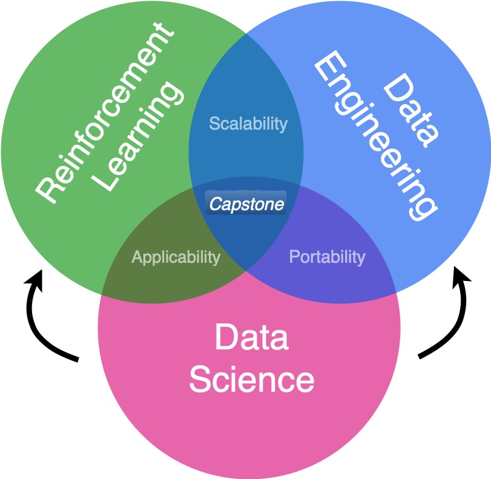
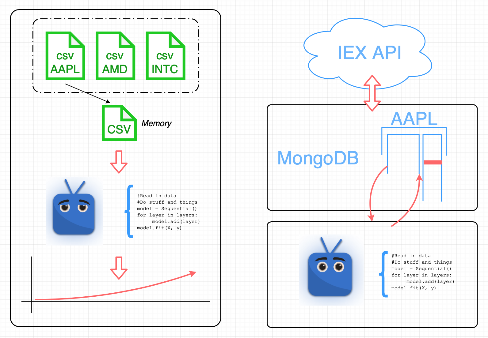
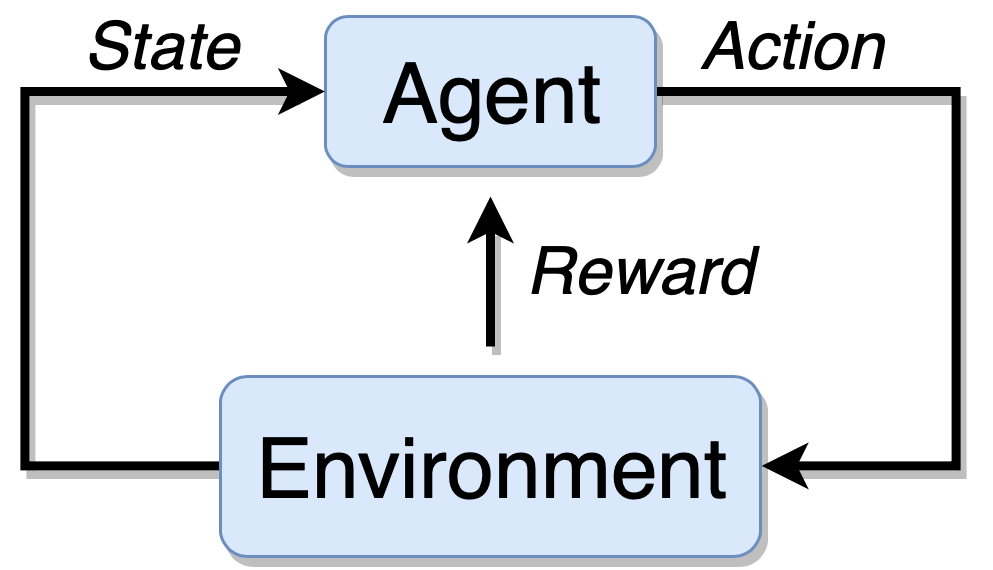
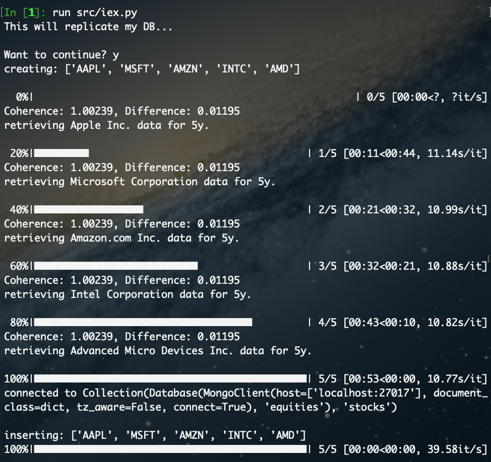

# tradeBot  
Purpose: Making a trading bot with RL, HER, DQN using an LSTM and MongoDB  

## Deploying Bots on Stocks  
- Sound Data Pipelines  
- Reinforcement Learning  

By: Derek Lorenzen  
Galvanize Data Science Immersive  

#### Data provided for free by IEX. View IEX’s Terms of Use.
##### https://iextrading.com/api-exhibit-a/
##### https://iextrading.com/developer

### About me:   
I study engineering/economics, not quantitative finance … yet.   
Pros:  
> This offers an interesting field to explore!  
> Lots of numbers and math  

Cons:  
> Spoiler - I have grown accustomed to the presence of “signal”

Project Background
To deploy “bots” on stocks one
needs:  
> Data Science Skills  
>> ML, statistics, math  

> Data Engineering  
>> Wise data stream
courteous to your ML
problem  

> A “bot”  
>> An agent acting in a
synthetic environment
(Harder than it seems...)  

  

## Why Reinforcement Learning?  
Sequence of Events  
1. Agent Gets a State
2. Makes a Decision
3. Receives a Reward
4. Agent Gets a State

Decisions  
> Bellman Equation, Action Value Function,
Discounted Future Rewards
State  
> Physics, Games … Each state must be
dependent only on the last. - MDP  
> Stocks: Eh, something’s driving it. - POMDP  

  

## Why a Database/MongoDB?
Document Based
Schema Free
> Each Stock is a document
with nested documents
containing summary data
and time series data.  
> Agent makes query for next
time observation.  

## API
IEX Exchange
Allows quick addition of extra
data.
(Building a new “document”
for a new stock or fund)

  

 
## Future work  
> Incorporate NLP!  
>> More obscure features
may add signal. This
approach is tailored for
expansion  

> Access Paid API  

> Research POMDP for RL  

## Resources 

Siraj Raval   
> https://github.com/llSourcell/Reinforcement_Learning_for_Stock_Prediction  
Shuai W  
> https://github.com/ShuaiW/teach-machine-to-trade    
Edward Hdlu  
> https://github.com/edwardhdlu/q-trader  
